## A ) Seed Bank

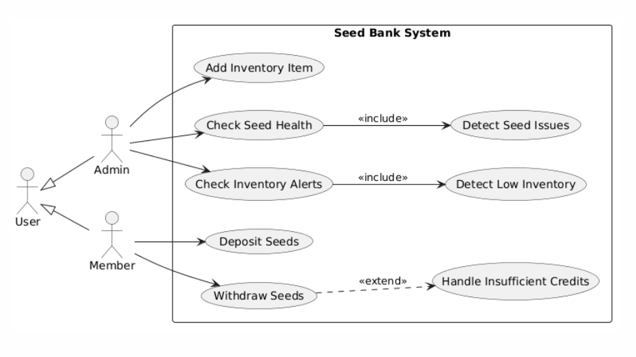
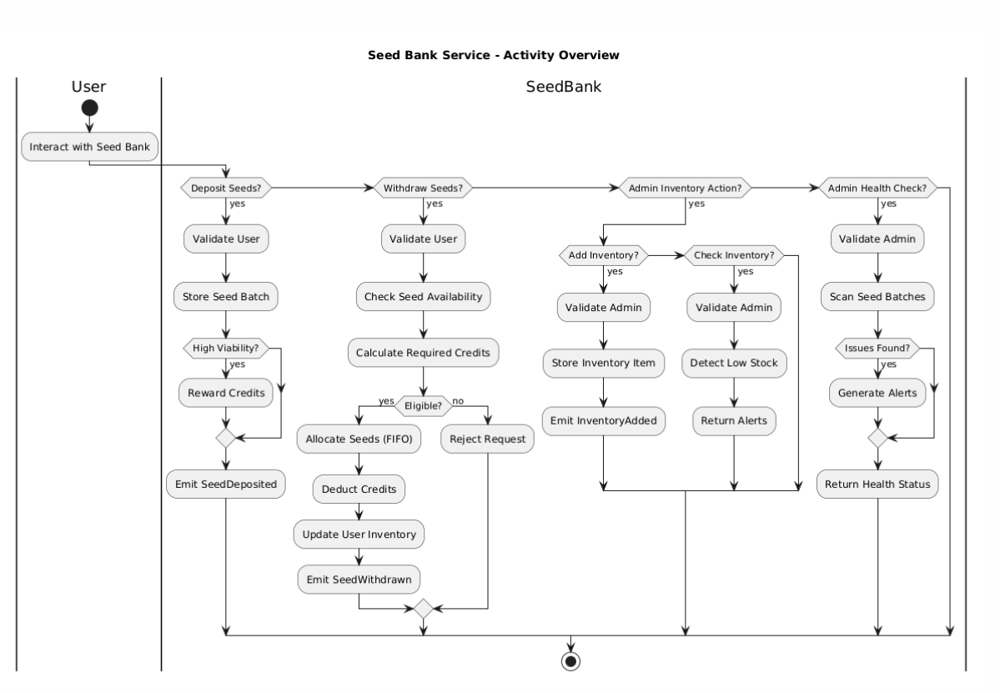

### UC-SB-01: Deposit Seeds
**Goal**: Allow a user to deposit seeds into the system and optionally earn credits based on seed quality.

**Initiator**: Member

**Pre-condition(s)**:
- User exists and has a valid ID
- Seed type and metadata are valid
- System is operational

**Post-condition(s)**:
- Seed batch is stored in system
- User balance may be updated (credits added if high quality)
- Event `SeedDeposited` is emitted

**Main Success Scenario**:
1. User submits seed deposit request
2. System validates user identity
3. System creates `SeedInfo` (viability, origin, age, etc.)
4. System creates a `SeedBatch`
5. Batch is stored under seed type
6. System checks viability threshold
7. If viability ≥ threshold, credits are added to user
8. Deposit event is emitted
9. System returns success result with batch info

**Alternative or Unsuccessful Scenarios**:
- **A1: Invalid User**  
  If user is missing or invalid → System raises `InvalidUserError`
- **A2: System Failure**  
  Unexpected exception occurs → System returns critical error response

---

### UC-SB-02: Withdraw Seeds
**Goal**: Allow a user to withdraw seeds using a credit-based system.

**Initiator**: Member

**Pre-condition(s)**:
- User exists
- Seed type exists
- User has enough credits
- Seeds are available in inventory

**Post-condition(s)**:
- Seeds are deducted from inventory
- User credits are reduced
- User inventory is updated
- Event `SeedWithdrawn` is emitted

**Main Success Scenario**:
1. User requests seed withdrawal
2. System validates user identity
3. System verifies seed type exists
4. System calculates required credits
5. System checks user credit balance
6. System sorts seed batches by age
7. System deducts seeds from batches
8. System updates seed inventory
9. User credits are reduced
10. Seeds are added to user inventory
11. Event `SeedWithdrawn` is emitted
12. System returns success result

**Alternative or Unsuccessful Scenarios**:
- **A1: Insufficient Credits**  
  System raises `InsufficientCreditsError` → Withdrawal is rejected
- **A2: Seed Type Not Found**  
  System raises `SeedTypeNotFoundError`
- **A3: Invalid User**  
  System raises `InvalidUserError`

---

### UC-SB-03: Add Inventory Item 
**Goal**: Allow admin to add inventory items used in seed management.

**Initiator**: Admin

**Pre-condition(s)**:
- User is admin
- Item name is valid and not duplicate

**Post-condition(s)**:
- Inventory item is stored
- Event `InventoryAdded` is emitted

**Main Success Scenario**:
1. Admin submits inventory item details
2. System validates admin permissions
3. System creates `InventoryItem`
4. Item is stored in inventory system
5. Event `InventoryAdded` is emitted
6. System returns success result

**Alternative or Unsuccessful Scenarios**:
- **A1: Unauthorized User**  
  System raises `AdminRequiredError`
- **A2: System Failure**  
  Unexpected error occurs → Operation fails with critical error

---

### UC-SB-04: Check Seed Health
**Goal**: Allow admin to audit seed batches for expiration or testing requirements.

**Initiator**: Admin

**Pre-condition(s)**:
- User is admin
- Seed batches exist in system

**Post-condition(s)**:
- System generates health alerts
- Expired or problematic seeds are flagged

**Main Success Scenario**:
1. Admin requests seed health check
2. System validates admin privileges
3. System iterates through all seed batches
4. Expired seeds are detected
5. Seeds requiring testing are detected
6. Alerts are compiled
7. System returns health report

**Alternative or Unsuccessful Scenarios**:
- **A1: Unauthorized User**  
  System raises `AdminRequiredError`
- **A2: System Failure**  
  System returns critical error response

---

### UC-SB-05: Check Inventory Alerts 
**Goal**: Detect inventory items that need restocking.

**Initiator**: Admin

**Pre-condition(s)**:
- User is admin
- Inventory exists in system

**Post-condition(s)**:
- Low-stock items are flagged
- Alert list is returned

**Main Success Scenario**:
1. Admin requests inventory check
2. System validates admin role
3. System scans all inventory items
4. Items below reorder threshold are detected
5. Alert list is generated
6. System returns alert result

**Alternative or Unsuccessful Scenarios**:
- **A1: Unauthorized User**  
  System raises `AdminRequiredError`
- **A2: System Failure**  
  Unexpected error occurs → System returns failure result

## B ) Tool Library

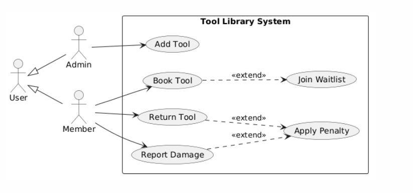
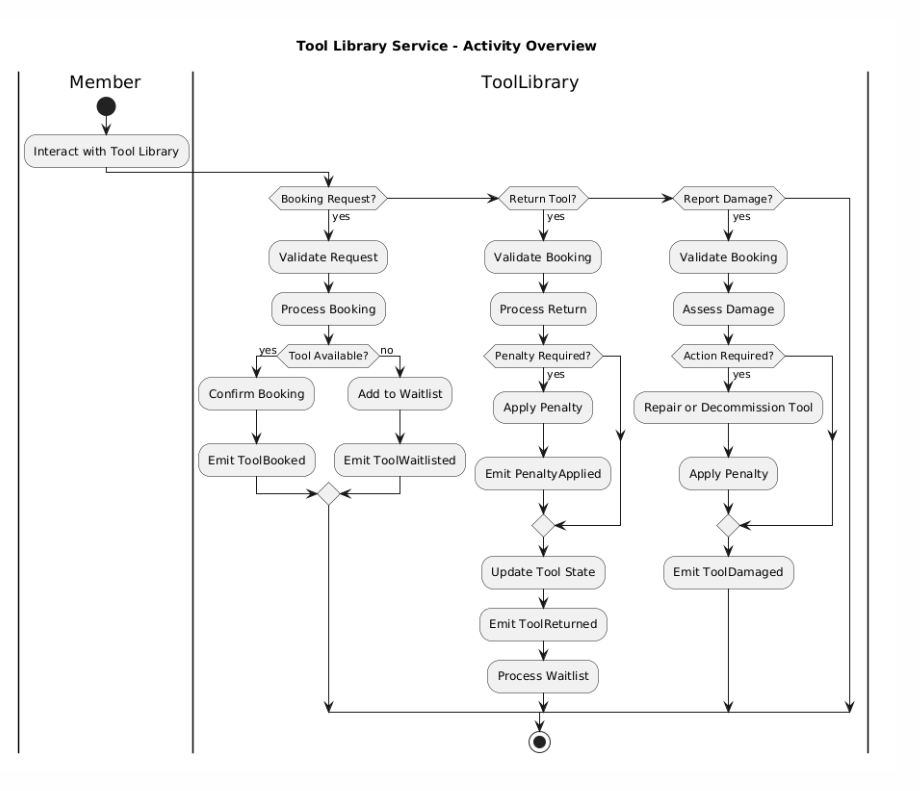

### UC-TL-01: Book Tool
**Goal**: Allow a user to book a tool for a specific duration or be placed on a waitlist if unavailable.

**Initiator**: User

**Pre-condition(s)**:
- User exists and is valid
- Tool exists in system
- Duration is greater than 0
- User has no blocking penalty

**Post-condition(s)**:
- Booking is created **OR** user is added to waitlist
- Tool state may change to “checked out”
- Event `ToolBooked` or `ToolWaitlisted` is emitted

**Main Success Scenario**:
1. User requests a tool booking
2. System validates user identity
3. System validates tool existence
4. System checks duration validity
5. System verifies user has no active penalties
6. System checks tool availability
7. Tool is available for requested time period
8. Booking is created and stored
9. Tool is marked as checked out
10. Booking is added to user record
11. Event `ToolBooked` is emitted
12. System returns successful booking result

**Alternative or Unsuccessful Scenarios**:
- **A1: Tool Not Available**  
  If tool is already booked or overlapping schedule exists → System adds user to waitlist → Event `ToolWaitlisted` is emitted
- **A2: User Has Active Penalty**  
  If user has pending penalty → System raises `UserPenaltyError` → Booking is rejected
- **A3: Invalid Input**  
  Tool not found or duration invalid → System raises validation error
- **A4: System Failure**  
  Unexpected exception occurs → Operation fails with critical error

---

### UC-TL-02: Return Tool
**Goal**: Handle tool return, update usage stats, and apply penalties if needed.

**Initiator**: User

**Pre-condition(s)**:
- Booking exists
- Tool is registered in system

**Post-condition(s)**:
- Tool is returned and availability updated
- Booking status updated (completed or overdue)
- Penalty may be applied
- Event `ToolReturned` is emitted

**Main Success Scenario**:
1. User returns tool
2. System verifies booking exists
3. System fetches tool data
4. Return time is recorded
5. System calculates usage duration
6. System checks if return is late
7. Booking status updated accordingly
8. Tool is returned to inventory
9. System updates tool usage stats
10. Event `ToolReturned` is emitted
11. Operation succeeds

**Alternative or Unsuccessful Scenarios**:
- **A1: Booking Not Found**  
  System raises `BookingNotFoundError`
- **A2: Tool Not Found**  
  System raises `ToolStateError`
- **A3: Late Return**  
  Booking marked as “overdue” → Late alert may be triggered via event handler
- **A4: System Failure**  
  Unexpected error → critical failure response

---

### UC-TL-03: Report Damage
**Goal**: Report damage on a tool and apply penalty or maintenance actions.

**Initiator**: User

**Pre-condition(s)**:
- Valid booking exists
- Tool exists in system
- Severity level is valid

**Post-condition(s)**:
- Tool state may change (repair or decommission)
- Penalty may be created
- Event `ToolDamaged` and `PenaltyApplied` emitted

**Main Success Scenario**:
1. User reports damage
2. System verifies booking
3. System validates tool existence
4. System checks severity level
5. If severity is low → no penalty applied
6. If medium → tool marked for repair
6. If high → tool decommissioned
7. Penalty is recorded (if applicable)
8. Tool state is updated
9. Events are emitted
10. System returns success result

**Alternative or Unsuccessful Scenarios**:
- **A1: Invalid Severity**  
  System raises `InvalidDamageSeverityError`
- **A2: Booking Not Found**  
  System raises `BookingNotFoundError`
- **A3: Tool Not Found**  
  System raises `ToolStateError`
- **A4: No Damage (Low Severity)**  
  No penalty applied → Only informational update occurs

---

### UC-TL-04: Add Tool 
**Goal**: Allow admin to add a new tool to the system.

**Initiator**: Admin

**Pre-condition(s)**:
- User is admin
- Tool does not already exist

**Post-condition(s)**:
- Tool is added to inventory
- Tool becomes available for booking

**Main Success Scenario**:
1. Admin submits tool details
2. System validates admin privileges
3. System checks tool uniqueness
4. Tool is created
5. Tool is stored in system
6. Event `ToolAdded` is emitted
7. System returns success result

**Alternative or Unsuccessful Scenarios**:
- **A1: Unauthorized User**  
  System raises `AuthorizationError`
- **A2: Tool Already Exists**  
  System raises `ToolStateError`
- **A3: Invalid Input**  
  Tool name invalid or missing → System raises validation error

## C ) Volunteer System

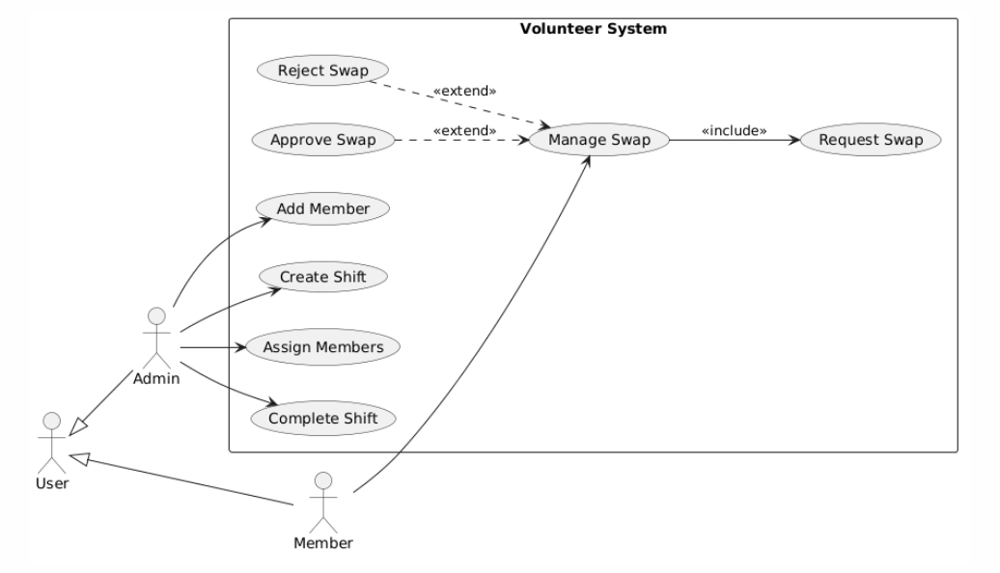
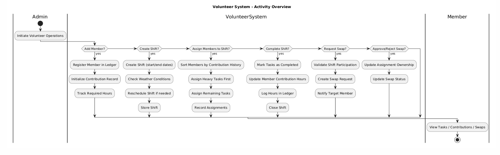

### UC-VS-01: Add Member
**Goal**: Register a new volunteer member into the system and initialize their contribution tracking.

**Initiator**: Admin

**Pre-condition(s)**:
- Admin is authenticated
- Member ID is valid and not empty
- Member does not already exist in ledger

**Post-condition(s)**:
- Member is added to system ledger
- Contribution tracking is initialized (`total_hours = 0`, `heavy_hours = 0`)
- Event `MemberAdded` is emitted

**Main Success Scenario**:
1. Admin submits a new member ID with required hours
2. System validates the member ID
3. System checks that member does not already exist
4. Ledger registers the new member
5. Contribution record is initialized
6. `MemberAdded` event is emitted
7. System returns success result

**Alternative or Unsuccessful Scenarios**:
- **A1: Invalid Member ID**  
  If member ID is empty or invalid → System raises `InvalidUserError` → Operation fails and returns error result
- **A2: System Failure**  
  Unexpected exception occurs → System returns `[Critical]` error message → No changes are saved

---

### UC-VS-02: Create Shift
**Goal**: Create a volunteer shift and optionally adjust it based on weather conditions.

**Initiator**: Admin

**Pre-condition(s)**:
- Admin is authenticated
- Start and end dates are valid
- Weather service is available

**Post-condition(s)**:
- Shift is created and stored
- Shift may be rescheduled due to weather
- Event `ShiftCreated` is emitted

**Main Success Scenario**:
1. Admin submits shift details
2. System validates admin permissions
3. System creates shift object
4. Weather service is checked for shift date
5. If weather is normal, shift is scheduled
6. Shift is stored in system
7. Event `ShiftCreated` is emitted
8. System returns success result

**Alternative or Unsuccessful Scenarios**:
- **A1: Unauthorized User**  
  If user is not admin → System raises `AuthorizationError` → Operation is rejected
- **A2: Weather Reschedule**  
  If heavy rain or extreme heat is detected → Shift dates are adjusted → Shift status set to rescheduled → Event still emitted with rescheduled flag
- **A3: Invalid Input / System Failure**  
  Any unexpected error → System returns critical failure message

---

### UC-VS-03: Assign Members to Shift
**Goal**: Assign volunteer members to tasks inside a shift fairly based on contribution history.

**Initiator**: Admin

**Pre-condition(s)**:
- Shift exists
- Members exist in system
- Admin is authorized

**Post-condition(s)**:
- Members are assigned to tasks
- Assignments are stored in shift
- Member task lists are updated
- Event `MembersAssigned` is emitted

**Main Success Scenario**:
1. Admin selects shift and members
2. System validates shift existence
3. System ensures members are valid
4. Members are sorted based on contribution history
5. Heavy tasks are assigned first
6. Remaining members get light tasks
7. Assignments are stored in shift
8. Member task records are updated
9. Event `MembersAssigned` is emitted
10. System returns success result

**Alternative or Unsuccessful Scenarios**:
- **A1: No Members Assigned**  
  If assignment result is empty → System logs alert: "No members assigned"
- **A2: Invalid Shift**  
  Shift not found → System raises `ShiftNotFoundError`
- **A3: System Failure**  
  Unexpected error occurs → Operation fails with critical error

---

### UC-VS-04: Request Swap (Manage Swap - Request Phase)
**Goal**: Allow a member to request a task swap with another member.

**Initiator**: Member

**Pre-condition(s)**:
- Member is assigned to a shift
- Shift exists
- Target member exists

**Post-condition(s)**:
- Swap request is created
- Request is stored in both users' records
- Event `SwapRequested` is emitted

**Main Success Scenario**:
1. Member selects another member for swap
2. System verifies shift existence
3. System checks requester assignment validity
4. Swap request object is created
5. Request is added to sender and receiver
6. Event `SwapRequested` is emitted
7. System returns success result

**Alternative or Unsuccessful Scenarios**:
- **A1: Not Assigned to Shift**  
  Requester is not part of shift → System raises `SwapRequestError`
- **A2: Shift Not Found**  
  Shift does not exist → System raises `ShiftNotFoundError`

---

### UC-VS-05: Approve/Reject Swap
**Goal**: Allow target member to approve or reject a swap request.

**Initiator**: Member (target of swap request)

**Pre-condition(s)**:
- Swap request exists
- Shift exists

**Post-condition(s)**:
- Assignment is updated **OR** request is rejected
- Event `SwapApproved` or `SwapRejected` is emitted

**Main Success Scenario (Approval)**:
1. Target member reviews swap request
2. System validates shift and assignment
3. Assignment is transferred to target
4. Request status is set to approved
5. Event `SwapApproved` is emitted
6. System returns success result

**Alternative or Unsuccessful Scenarios**:
- **A1: Invalid Request**  
  Request does not exist → System raises `SwapRequestError`
- **A2: Assignment Not Found**  
  System cannot locate assignment → System raises `AssignmentError`
- **A3: Rejection Flow**  
  Member rejects request → Request status set to rejected → Event `SwapRejected` emitted

## D ) Market Place

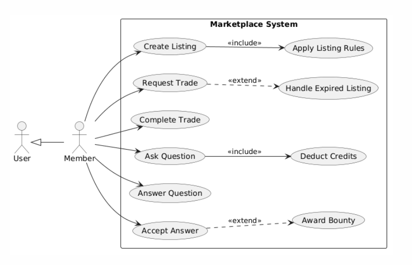
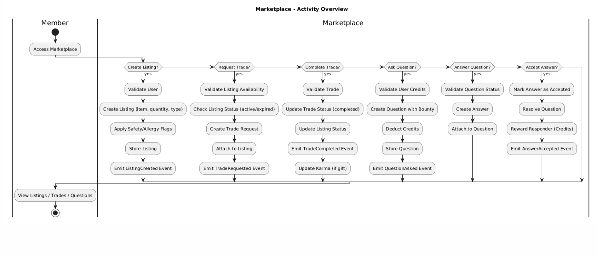

### UC-MP-01: Create Listing
**Goal**: Allow a member (seller) to create a listing for an item in the marketplace.

**Initiator**: Member (Seller)

**Pre-condition(s)**:
- User exists and is valid
- Item and quantity are valid
- Listing type is defined (normal/gift/flash)
- Seller is authenticated

**Post-condition(s)**:
- Listing is created and stored
- Listing is linked to seller profile
- Event `ListingCreated` is emitted

**Main Success Scenario**:
1. Seller submits listing details
2. System validates user identity
3. System creates listing object
4. Listing is added to seller profile
5. System applies listing rules (e.g., allergies/filters)
6. Listing is stored in marketplace
7. Event `ListingCreated` is emitted
8. System returns success result with listing

**Alternative or Unsuccessful Scenarios**:
- **A1: Invalid User**  
  If user is missing or invalid → System raises `InvalidUserError`
- **A2: System Failure**  
  Unexpected exception occurs → Operation fails with critical error

---

### UC-MP-02: Request Trade
**Goal**: Allow a buyer to request a trade on an active listing.

**Initiator**: Member (Buyer)

**Pre-condition(s)**:
- Listing exists
- Listing is active
- Listing is not expired (for flash type)
- Buyer is valid

**Post-condition(s)**:
- Trade request is created
- Trade is linked to listing
- Event `TradeRequested` is emitted

**Main Success Scenario**:
1. Buyer selects a listing
2. System validates buyer identity
3. System checks listing existence
4. System verifies listing is active
5. System checks expiration (if flash listing)
6. Trade object is created
7. Trade is added to listing
8. Event `TradeRequested` is emitted
9. System returns success result

**Alternative or Unsuccessful Scenarios**:
- **A1: Listing Not Active**  
  System raises `TradeError`
- **A2: Listing Expired**  
  Listing is marked expired → Trade request is rejected
- **A3: Invalid Listing**  
  System raises `ListingNotFoundError`

---

### UC-MP-03: Complete Trade
**Goal**: Allow the seller to finalize and complete an accepted trade.

**Initiator**: Member (Seller)

**Pre-condition(s)**:
- Trade exists
- Listing exists
- Seller is owner of listing
- Trade is valid

**Post-condition(s)**:
- Trade status is set to completed
- Listing is marked completed
- Event `TradeCompleted` is emitted

**Main Success Scenario**:
1. Seller confirms trade completion
2. System validates trade existence
3. System retrieves associated listing
4. System confirms seller ownership
5. Trade status is updated to completed
6. Listing status is updated to completed
7. Event `TradeCompleted` is emitted
8. System returns success result

**Alternative or Unsuccessful Scenarios**:
- **A1: Invalid Trade**  
  Trade is null or missing → System raises `TradeError`
- **A2: Listing Not Found**  
  System raises `ListingNotFoundError`
- **A3: Unauthorized Action**  
  If user is not seller → System blocks operation

---

### UC-MP-04: Ask Question (Bounty System)
**Goal**: Allow a member to post a question with an optional bounty reward.

**Initiator**: Member

**Pre-condition(s)**:
- User exists
- User has enough credits for bounty (if used)
- Question content is valid

**Post-condition(s)**:
- Question is stored in system
- Bounty is deducted from user balance
- Event `QuestionAsked` is emitted

**Main Success Scenario**:
1. User submits question with bounty
2. System validates user identity
3. System checks credit balance
4. Question object is created
5. Question is stored in system
6. User credits are deducted
7. Event `QuestionAsked` is emitted
8. System returns success result

**Alternative or Unsuccessful Scenarios**:
- **A1: Insufficient Credits**  
  System raises `QuestionError`
- **A2: Invalid User**  
  System raises `InvalidUserError`

---

### UC-MP-05: Answer Question
**Goal**: Allow a member to answer an open question.

**Initiator**: Member

**Pre-condition(s)**:
- Question exists
- Question is open
- Answer content is valid

**Post-condition(s)**:
- Answer is attached to question
- Question remains open until accepted
- No credit transfer yet

**Main Success Scenario**:
1. User submits answer
2. System validates question existence
3. System checks question status is open
4. Answer is created
5. Answer is appended to question
6. System returns success result

**Alternative or Unsuccessful Scenarios**:
- **A1: Question Not Found**  
  System raises `QuestionError`
- **A2: Question Closed**  
  System rejects answer submission

---

### UC-MP-06: Accept Answer
**Goal**: Allow question owner to accept an answer and reward bounty.

**Initiator**: Member (Question Owner)

**Pre-condition(s)**:
- Question exists
- Answer exists
- Question is open

**Post-condition(s)**:
- Answer is marked accepted
- Question is resolved
- Event `AnswerAccepted` is emitted
- Bounty is awarded to responder

**Main Success Scenario**:
1. Question owner selects answer
2. System validates question and answer
3. Answer is marked accepted
4. Question status is set to resolved
5. Event `AnswerAccepted` is emitted
6. Bounty is transferred to responder
7. System returns success result

**Alternative or Unsuccessful Scenarios**:
- **A1: Invalid Answer**  
  System raises `AnswerError`
- **A2: Question Already Resolved**  
  System rejects operation

## E ) Rental Service

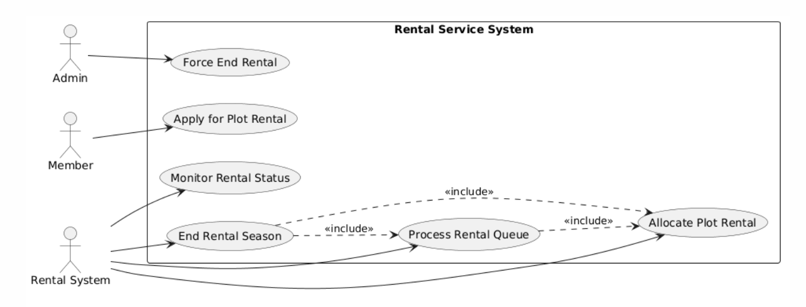
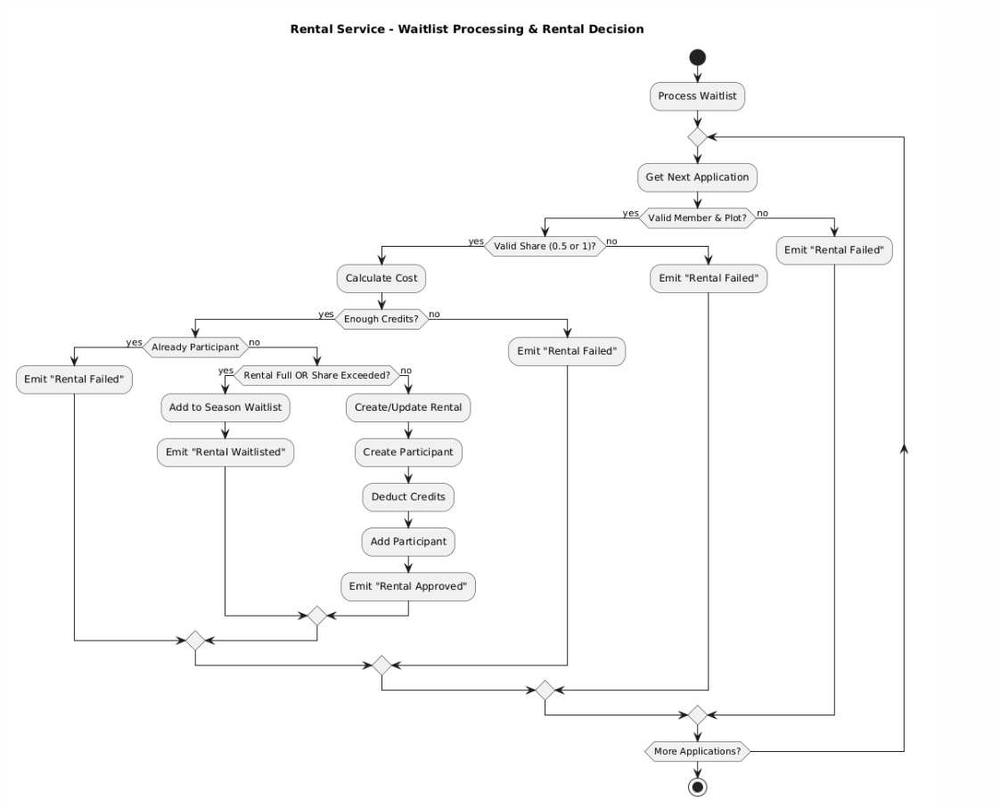

### UC-RS-01: Apply for Plot Rental
**Goal**: Allow a member to apply for renting a garden plot.

**Initiator**: Member

**Pre-condition(s)**:
- Member exists
- Plot exists
- Plot has a waitlist system available
- Application data is valid

**Post-condition(s)**:
- Application is added to plot waitlist
- Event `ApplicationSubmitted` is emitted

**Main Success Scenario**:
1. Member submits rental application
2. System validates member existence
3. System validates plot existence
4. Application object is created
5. Application is added to plot waitlist
6. Event `ApplicationSubmitted` is emitted
7. System returns success result

**Alternative or Unsuccessful Scenarios**:
- **A1: Invalid Member**  
  System raises `MemberNotFoundError`
- **A2: Invalid Plot**  
  System raises `PlotNotFoundError`
- **A3: System Failure**  
  Unexpected error → operation fails safely

---

### UC-RS-02: Allocate Rental (Internal System Process)
**Goal**: Allocate a plot to a member based on availability and application priority.

**Initiator**: System (Rental Service Engine)

**Pre-condition(s)**:
- Valid application exists
- Plot exists
- Member exists
- Current season is active

**Post-condition(s)**:
- Rental is created **OR** application is waitlisted
- Member credits may be deducted
- Event `RentalApproved` or `RentalWaitlisted` is emitted

**Main Success Scenario**:
1. System processes application queue
2. System validates member and plot
3. System checks share value (0.5 or 1.0)
4. System calculates rental cost
5. System verifies member credits
6. System checks plot availability
7. Rental object is created if possible
8. Participant is added to rental
9. Member credits are deducted
10. Event `RentalApproved` is emitted
11. System returns successful rental result

**Alternative or Unsuccessful Scenarios**:
- **A1: Insufficient Credits**  
  System raises `InsufficientCreditsError` → Event `RentalFailed` emitted
- **A2: Plot Fully Occupied**  
  Application moved to waitlist → Event `RentalWaitlisted` emitted
- **A3: Invalid Share**  
  System raises `InvalidShareError`
- **A4: Duplicate Participant**  
  Member already in rental → System raises `DuplicateParticipantError`

---

### UC-RS-03: End Rental Season (System Lifecycle Event)
**Goal**: Close a rental season and transition plots into next season state.

**Initiator**: System (Season Controller)

**Pre-condition(s)**:
- Season has ended
- Plots have active rentals

**Post-condition(s)**:
- Rentals are archived
- Participants are terminated or renewed
- Waitlists are processed
- Event `RentalExpired` is emitted

**Main Success Scenario**:
1. System detects season end
2. Active rental is marked expired
3. Rental is stored in history
4. Auto-renew participants are re-applied
5. Non-renew participants are terminated
6. Waitlist is cleared or processed
7. Event `RentalExpired` is emitted
8. System attempts new allocations

**Alternative or Unsuccessful Scenarios**:
- **A1: Auto-renew failure**  
  Member loses eligibility or credits → Application skipped
- **A2: Waitlist conflict**  
  No available slots → Applications remain queued

---

### UC-RS-04: Process Waitlist
**Goal**: Allocate available plots to queued applications based on priority.

**Initiator**: System

**Pre-condition(s)**:
- Plot has waitlist entries
- Available capacity exists
- Applications are valid

**Post-condition(s)**:
- Some applications become active rentals
- Others remain in waitlist
- Event `RentalApproved` or `RentalWaitlisted`

**Main Success Scenario**:
1. System retrieves waitlist
2. Applications are sorted by priority score
3. System checks each application
4. Availability is checked per request
5. Valid applications are allocated rental
6. Invalid ones remain in queue
7. Events emitted accordingly
8. Waitlist is updated

**Alternative or Unsuccessful Scenarios**:
- **A1: No available plots**  
  All applications remain queued
- **A2: Invalid application state**  
  Application skipped

---

### UC-RS-05: Alert Rental Status (Monitoring Use Case)
**Goal**: Monitor rental participants for upcoming expiration or renewal risk.

**Initiator**: System Monitor

**Pre-condition(s)**:
- Active rentals exist

**Post-condition(s)**:
- Participant statuses updated
- Alerts generated

**Main Success Scenario**:
1. System scans active rentals
2. Each participant is evaluated
3. Auto-renew participants flagged as expiring soon
4. Others flagged for termination
5. Alerts stored in system
6. System returns monitoring update

**Alternative or Unsuccessful Scenarios**:
- **A1: No active rentals**  
  No action performed

## Plot Service (INTERNAL)
 
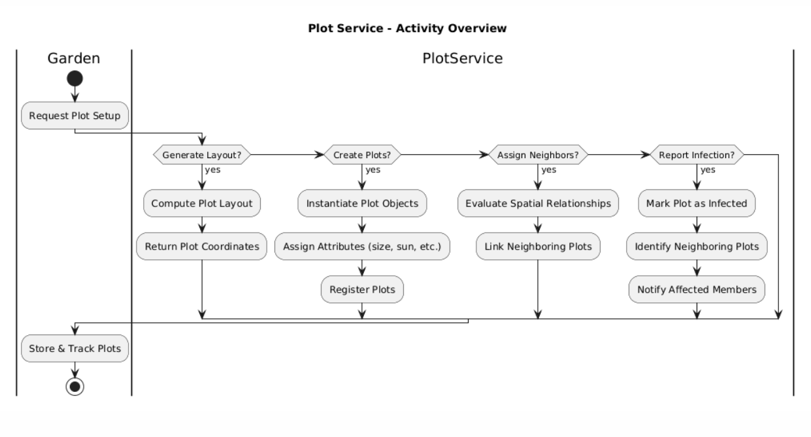
