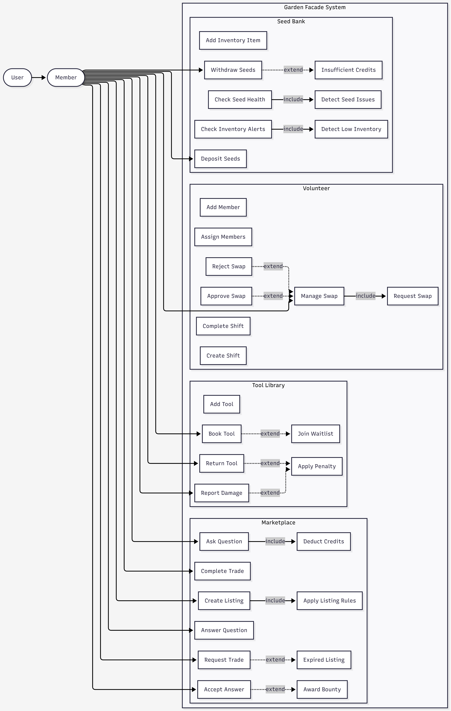
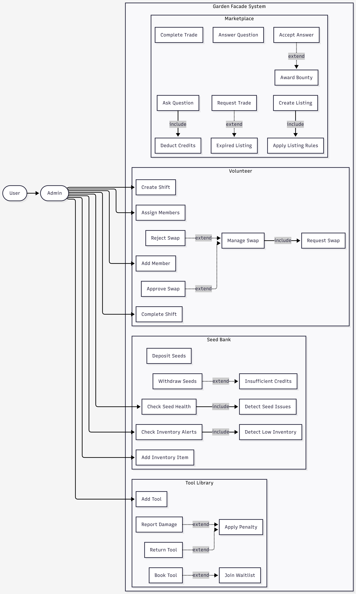

# Garden Facade System — Unified Use Case Specification

---

## UC-01: Interact with Garden System

### Goal
Provide a unified interface for members and administrators to manage seeds, tools, marketplace activities, volunteering, and rental services within the community garden ecosystem.

---

## Actors
- Member: Performs operational actions such as deposits, bookings, trades, and requests
- Admin: Manages system configuration, monitoring, and administrative operations
- System (Internal Services): Executes automated processes such as allocation, validation, lifecycle events, and monitoring

---

## Pre-conditions
- User is authenticated as Member or Admin
- System services are operational
- Required resources exist where applicable (seeds, tools, listings, plots)
- User has sufficient permissions for the requested operation

---

## Post-conditions
- Requested operation is completed successfully or rejected with appropriate error handling
- System state is updated accordingly
- Relevant domain events are emitted (e.g., SeedDeposited, ToolBooked, TradeCompleted, RentalApproved)

---

## Main Success Scenario

1. User accesses the Garden System
2. System identifies user role as Member or Admin
3. User selects an operation within the system
4. System validates input data and permissions
5. System routes request to the appropriate subsystem:
   - Seed Bank System
   - Tool Library System
   - Marketplace System
   - Volunteer System
   - Rental Service System
6. Subsystem executes business logic
   - Applies validation rules
   - Updates system state
   - Performs required calculations (credits, availability, allocation, scoring)
7. System emits relevant domain event(s)
8. System returns a success response with updated state

---

## Alternative and Failure Scenarios

### A1: Invalid User
System raises AuthenticationError and rejects the operation.

### A2: Unauthorized Access
System raises AuthorizationError when a user attempts an action beyond their role.

### A3: Invalid Input
System rejects the request due to missing or malformed data and returns a validation error.

### A4: Resource Not Found
System raises a NotFoundError if the requested seed, tool, listing, or plot does not exist.

### A5: Business Rule Violation
System rejects the operation due to constraints such as insufficient credits, invalid state, or policy violations.

### A6: System Failure
Unexpected runtime error occurs; system returns a critical failure response without corrupting state.

---

## Subsystem Overview

### Seed Bank System
- Deposit Seeds
- Withdraw Seeds
- Add Inventory Item (Admin)
- Check Seed Health (Admin)
- Check Inventory Alerts (Admin)

---

### Tool Library System
- Book Tool
- Return Tool
- Report Damage
- Add Tool (Admin)

---

### Marketplace System
- Create Listing
- Request Trade
- Complete Trade
- Ask Question
- Answer Question
- Accept Answer

---

### Volunteer System
- Add Member (Admin)
- Create Shift (Admin)
- Assign Members (Admin)
- Request Swap
- Approve Swap
- Reject Swap

---

### Rental Service System
- Apply for Plot Rental
- Allocate Rental (System)
- Process Waitlist (System)
- End Rental Season (System)

---

## Domain Events

- SeedDeposited
- SeedWithdrawn
- ToolBooked
- ToolReturned
- ToolDamaged
- ListingCreated
- TradeRequested
- TradeCompleted
- QuestionAsked
- AnswerAccepted
- MemberAdded
- ShiftCreated
- SwapRequested
- SwapApproved
- SwapRejected
- RentalApproved
- RentalWaitlisted
- RentalExpired

---

## Design Notes

- The system follows a modular architecture
- Subsystems are separated by domain responsibility
- A unified interface routes all user interactions
- Authorization is role-based (Member vs Admin)
- Event-driven design is used for tracking state changes and integration

---

## Summary

This document defines a unified use case model for the Garden Facade System, consolidating all subsystem interactions into a single coherent operational flow for improved maintainability, clarity, and system consistency.
